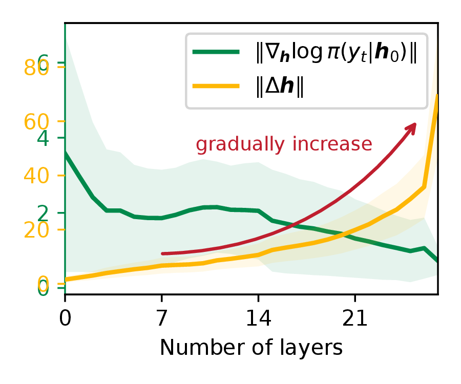
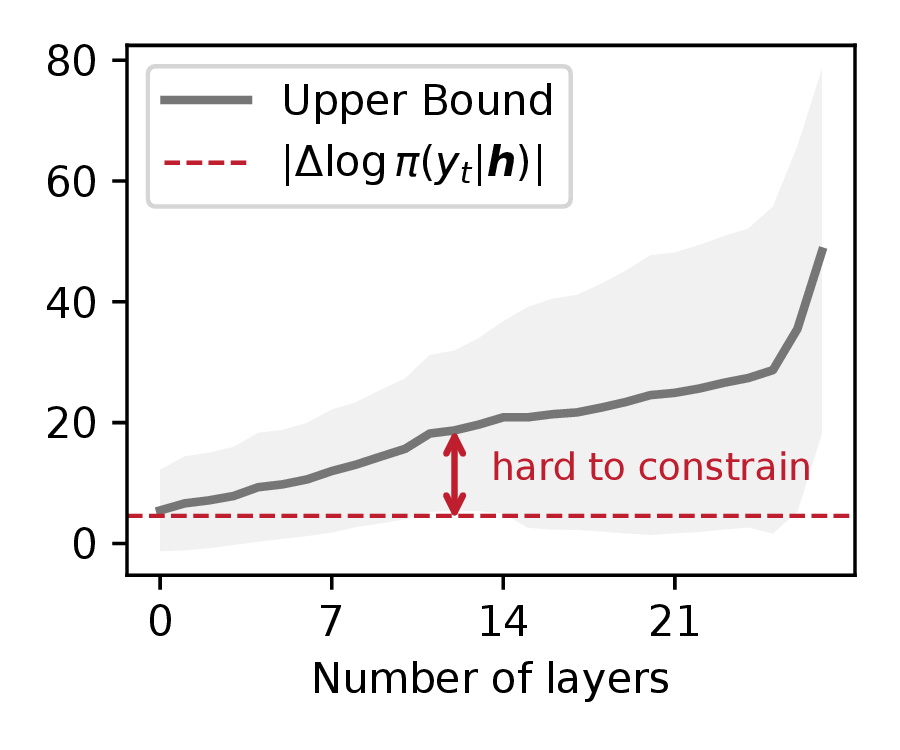

# Understanding the Prompt Sensitivity

This repository contains code and notebooks for analyzing prompt sensitivity in LLMs, accompanying our ACL 2026 paper *Understanding the Prompt Sensitivity*.

## TL;DR:

Prompt sensitivity is because:
 - $\lVert \Delta \mathbf{h} \rVert$ **gradually increases** from close to 0 to approximately 70 across the model layers.
 - The increase of $\lVert \Delta \mathbf{h} \rVert$ leads to an increasing trend of the upper bound across layers, making it impossible to converge to sufficiently low values and **hard to constrain** $\lvert \Delta \log \pi (y_t \mid \mathbf{h}) \rvert$ to 0 via the upper bound.

<table>
  <tr>
    <td></td>
    <td></td>
  </tr>
</table>

This repo includes:

- Experimental source code (`/code`)
- Datasets and prompts (`/input`)
- Experimental results (`/results`)
- Plotting notebooks for figures (`/plot`)

## Setup

Recommended Python 3.9+ with:

- torch, torchvision
- transformers, huggingface_hub
- numpy, pandas, tqdm

We are using Hugging Face models, make sure you are authenticated.
The scripts call `huggingface_hub.login(token=...)` and expect a token.

## Data and prompts

The LLM experiments expect prompt templates and dataset files under `input/`:

```
input/
  12prompts.json
  misalignment_prompts.json
  ARC_Challenge/data_500.jsonl
  CommonSenseQA/data_500.jsonl
  MMLU/data_500.jsonl
  OpenBookQA/data_500.jsonl
```

These files are not included in the repo. Place your datasets and prompt
templates in the paths above before running the scripts.

## Running LLM experiments
Explanation of experimental code (under `code/experimental_verifications`):
| Code | Explanation |
|----|----|
| why_prompt_sensitivity.py | Code for explaining why LLMs exhibit prompt sensitivity |
| misalignment.py | Code for which types of modifications are more likely to cause prompt sensitivity |
| other_token_answer.py | Code for analyzing other tokens as $y_t$ |
| factor.py | Code for analyzing the contribution of prompt templates and the questions themselves to logits |

Each script writes results to `results/data_results/...`:

```
python code/experimental_verifications/why_prompt_sensitivity.py \
  --model_name_or_path Qwen/Qwen1.5-0.5B \
  --dataset OpenBookQA \
  --cache_path /path/to/hf/cache

python code/experimental_verifications/misalignment.py \
  --model_name_or_path Qwen/Qwen1.5-0.5B \
  --dataset OpenBookQA \
  --cache_path /path/to/hf/cache

python code/experimental_verifications/factor.py \
  --model_name_or_path Qwen/Qwen1.5-0.5B \
  --dataset OpenBookQA \
  --cache_path /path/to/hf/cache

python code/experimental_verifications/other_token_answer.py \
  --model_name_or_path Qwen/Qwen1.5-0.5B \
  --dataset OpenBookQA \
  --target_token correctKey \
  --cache_path /path/to/hf/cache
```

Outputs:

- `results/data_results/real_dataset/<model>/<dataset>_result.jsonl`
- `results/data_results/misalignment/<model>/<dataset>_result.jsonl`
- `results/data_results/factors/<model>/<dataset>_logit.csv`
- `results/data_results/target_token/<token>/<model>/<dataset>_result.jsonl`

## CIFAR-10 example

Train a ResNet-101 on CIFAR-10 and save layer-wise distance metrics:

```
python code/cifar10_example/train.py
```

Results are written to `results/data_results/cifar10_all_layers/cifar10_results.jsonl`.

## Plotting

Notebooks under `plot/` read from `results/` and generate the figures used in
the analysis. 

## Citation:
todo